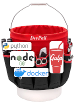

# DevPail - a bucket of development tooling

*This is version **2.0.0**.*

[![GitHub package.json version][shield-gh-json-version]][gh-repo]
[![License][shield-gh-license]][gh-license]
[![Package Version (npm)][shield-npm-version]][npm-package]
[![Downloads Per Month (npm)][shield-npm-downloads-month]][npm-versions]
[![Buy Me A Coffee][shield-bmac]][bmac]

**DevPail** is what you carry all your DevTools in.  

**DevPail** builds flexible [Docker] container and
[GulpJS] task runner combinations which isolate and
encapsulate your projects' development environments, so you don't have to.

You don't need to write a custom Gulpfile for each project, but instead
configure the operation of Gulp via directives in `package.json` which enable
various plugins.

## Installation

Before you use **DevPail**, you will need a working installation of
[Docker].

Since **DevPail** can (should!) be used across multiple projects, it's best to
install it globally:

```console
npm install --global devpail
```

If you intend modify the code before use:

```console
git clone https://github.com/tdesposito/DevPail.git
cd DevPail
npm link .
```

## Usage

Before you can start using **DevPail**, you'll need to build at least the
default image (python3.8/node14):

```console
$ devpail --build
DevPail: Building image "devpail:default"...
... lots of stuff happens ...
```

You can pass Docker ARG parameters directly on the above to customize the build.

> **WARNING: The Docker image DevPail builds will contain various secrets from your local machine, including AWS access keys, SSH keys, and Git credentials. *DO NOT PUBLISH OR SHARE YOUR DevPail IMAGES*!**

To initialize your project, in the top-level project directory (where your
`package.json` and other project files are):

```console
$ devpail --init
DevPail: Setting defaults for your project...
```

**DevPail** creates a Docker volume to contain all your development tooling
(NodeJS modules, Python packages, and so forth), and a Docker container which
mounts that volume and your source code. Inside that container, it runs a
plugin-based GulpJS task runner. Rather than constructing a bespoke
`gulpfile.js` for each project, you configure **DevPail** plugins via your
`package.json` file. How? Oh, look, that's right here!

## Configuration

Configuration for your **DevPail** is kept under the `devpail` key in your
`package.json` file. You can use `devpail --init` to provide you with a
skeleton. (Even if your project isn't Node-based, you'll need a `package.json`
to track the tooling used by **DevPail**.)

### Ports

**DevPail** uses ports 3000-3009 inside the container. 3000 is always a
BrowserSync server, and 3009 is the BrowserSync UI. Use of the remaining ports
is optional and application-specific. You specify which you want mapped onto
your local ports with the `ports` key, which is an array of "`host`:`container`"
mappings, i.e.:

```json
"devpail": {
    "ports": [ "8080:3000", "4044:3009" ]
}
```

This makes the container's browser-sync available as `localhost:8080`, and the
browser-sync UI as `localhost:4044`. **You MUST list the container's port 3000
FIRST!**

### Compiler and Server Plugins

In **DevPail**'s parlance, _Server_ and _Compiler_ plugins manage distinct parts
of the development and build processes.

During development, a _Server_ plugin can affect the BrowserSync configuration,
and it may start a long-running process (such as a Flask instance) which is
proxied (or not) into BrowserSync. A _Compiler_ plugin has access to the
BrowserSync instance, so it CANNOT alter the BrowserSync configuration.

During the `build` task, all the _Server_ plugins run in series (unless
otherwise configured), then all the _Compiler_ plugins run in parallel (unless
otherwise configured).

Plugins may not need specific configuration, in which case they can be listed by
name. If they need configuration, they are listed in an object which contains
that configuration. For example:

```JSON
"devpail": {
  "compilers": [
    "compiler/html/terser",
    {
      "plugin": "compiler/javascript/uglify",
      "source": "javascriptSource",
    },
    "compiler/css/clean-css"
  ],
  "Servers": [
    {
      "server": "server/flask",
      "environ": {
        "FLASK_CONFIG_VAR": "flask-config-value"
      }
    }
  ]
}
```

In this case, the `terser` and `clean-css` plugins will operate based on their
defaults, while the `uglify` and `flask` plugins will use the provided
configuration.

### Task plugins

Task plugins provide additional Gulp tasks which are added to the Gulp task list, thus:

```JSON
"devpail": {
  "tasks": [
    {
      "name": "serve",
      "plugin": "task/serve/serve-static"
    },
    {
      "name": [ "deploy", "deploy:setup" ],
      "plugin": "task/deploy/aws-s3",
      "bucket": "my-app-deploy-bucket"
    }
  ]
}
```

Each Task plugin is connected to one or more task names in the Gulp task
registry, as listed. Configuration parameters are as with other plugin types.

### Plugin Location

Each plugin is loaded either from the project source code, or via a CDN over the
wire.

To specify a local plugin, use the form `~dir/to/plugin` (note the leading `~`),
which will try to find `plugin.js` in `dir/to` in your source tree.

Otherwise, the plugin is loaded from the CDN defined by the `devpail.moduleCDN`
parameter (if any) in your `package.json`.

If you need to operate without internet access, **DevPail** can provide a "local
CDN" with these steps:

1. Run `devpail --cdn` from a terminal. The "local CDN" will run on port 8000 unless you specify a port number after `--cdn`.
1. Set `devpail.moduleCDN` to `http://host.docker.internal:8000`, or whatever port you specified above.
1. Run `devpail` as usual!

## MetaTasks

Some tasks are composed of other tasks; these are *metatasks*. For example, the default `build` task is implemented by running the `clean:build` task, followed by the `devpail:build` task.

You define your own *metatasks*, including **overriding** a built-in *metatask*, thusly:

```json
"devpail": {
  "metatasks": {
    "my-meta-task": [
      "task-1",
      [ "task-2", "task-3" ], 
      "task-4"
    ]
  }
}
```

This creates a new task, *my-meta-task*, which runs *task-1*, then runs *task-2*
and *task-3* simultaneously (in parallel), then runs *task-4*.

The default *metatasks* are:

* `build`: 'clean:build', 'devpail:build'
* `clean`: [ 'clean:build', 'clean:dev' ]


## Running the development environment

To run the environment, once configured:

```console
$ devpail
DevPail: Starting your development environment...
[19:57:29] Using gulpfile ~/app/gulpfile.js
[19:57:29] Starting 'default'...
[Browsersync] Access URLs:
 ----------------------------
 Local: http://localhost:3000
 ----------------------------
    UI: http://localhost:3009
 ----------------------------
[Browsersync] Serving files from: dev/
```

> The first time you run `devpail`, it will have to install at least a few modules, possibly many, which may take a bit of time. But after the first run, it'll go pretty quickly.

Please remember that the 3000 port specified by BrowserSync is **inside** the
container. The port you should browse to is defined in your `devpail.ports`
configuration.

You can get a shell into the **DevPail** container:

```console
$ devpail --shell
DevPail: Running a shell in your project container...
pn@your-project-f44be227:~/app$ 
```

From there you can:

* Install additional project dependencies
  * `npm install --save some-package-name`
  * `poetry add some-package-name`
* Run `gulp --tasks` or `gulp some-task-name`
* Most anything else you'd do from a command prompt.

You can also pass Gulp task name(s) and parameters to the Gulp instance via `devpail`:

```console
$ devpail --tasks
DevPail: Starting your development environment...
[20:05:32] Tasks for ~/app/gulpfile.js
[20:05:32] ├── build
[20:05:32] ├── clean
[20:05:32] ├── clean:dev
[20:05:32] ├── clean:deploy
[20:05:32] ├── default
[20:05:32] ├── deploy
[20:05:32] └── deploy:setup
```

## Setting Secrets via .env

**DevPail** will inject environment variables specified in an `.env` file at the
top level of your source tree into your container's environment.

## TODO: List of Plugins

## TODO: Developing Plugins

## How to Contribute

We gratefully accept:

* [Suggestions][gh-suggestions]
* [Bug Reports][gh-issues]
* [Pull Requests][gh-pulls]
* [Donations][bmac]

<!-- Please see [CONTRIBUTING.md](/CONTRIBUTING.md) for all the details. -->

## Donating

I release (most of?) my code under the MIT license, so it's free to use any way
you'd like. If you use it and appreciate the efforts I've put into it, please
consider [Buying Me A Coffee][bmac]!

<a href="https://www.buymeacoffee.com/tdesposito" target="_blank"></a>

## License

Please see the [License](/LICENSE).

<!-- Links  -->
[bmac]: https://www.buymeacoffee.com/tdesposito
[gh-issues]: https://github.com/tdesposito/devpail/issues
[gh-license]: https://github.com/tdesposito/devpail/blob/main/LICENSE
[gh-pulls]: https://github.com/tdesposito/devpail/pulls
[gh-repo]: https://github.com/tdesposito/devpail
[gh-suggestions]: https://github.com/tdesposito/devpail/discussions
[npm-package]: https://npmjs.org/package/devpail
[npm-versions]: https://www.npmjs.com/package/devpail?activeTab=versions
[pypi-project]: https://pypi.org/project/devpail/
[rtd-latest]: https://devpail.readthedocs.io/en/latest/
[shield-bmac]: https://img.shields.io/badge/Donate-Buy%20me%20a%20coffee-purple.svg
[shield-gh-latest-tag]: https://img.shields.io/github/v/tag/tdesposito/devpail
[shield-gh-json-version]: https://img.shields.io/github/package-json/v/tdesposito/devpail/main?label=latest-version
[shield-gh-license]: https://img.shields.io/github/license/tdesposito/devpail
[shield-npm-downloads-month]: https://img.shields.io/npm/dm/devpail
[shield-npm-version]: https://img.shields.io/npm/v/devpail
[shield-pypi-version]: https://img.shields.io/pypi/v/devpail
[shield-pypi-python-versions]: https://img.shields.io/pypi/pyversions/devpail
[shield-rtd]: https://readthedocs.org/projects/devpail/badge/?version=latest
[gh-license]: https://github.com/tdesposito/devpail/blob/main/LICENSE
[shield-gh-license]: https://img.shields.io/github/license/tdesposito/devpail

[Docker]: https://docker.com
[GulpJS]: https://gulpjs.com